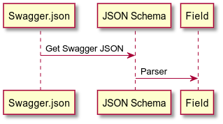
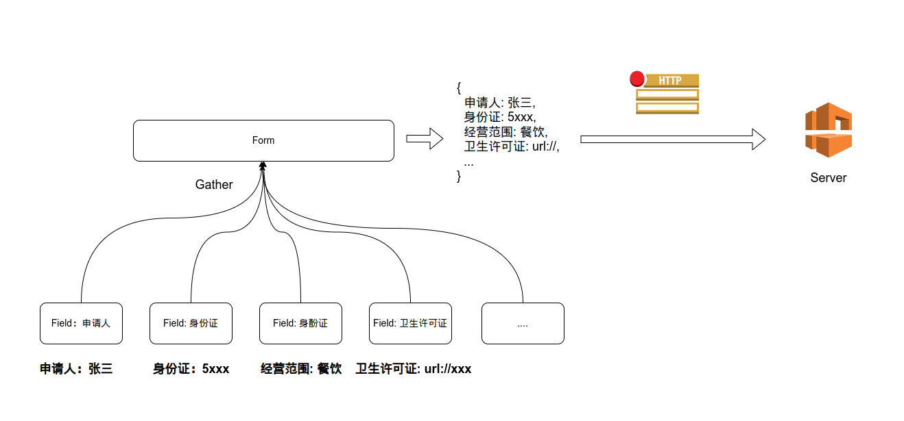
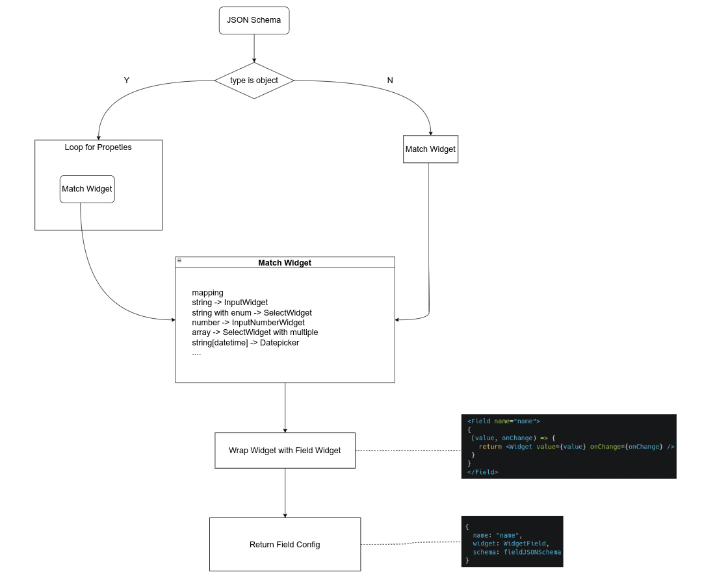
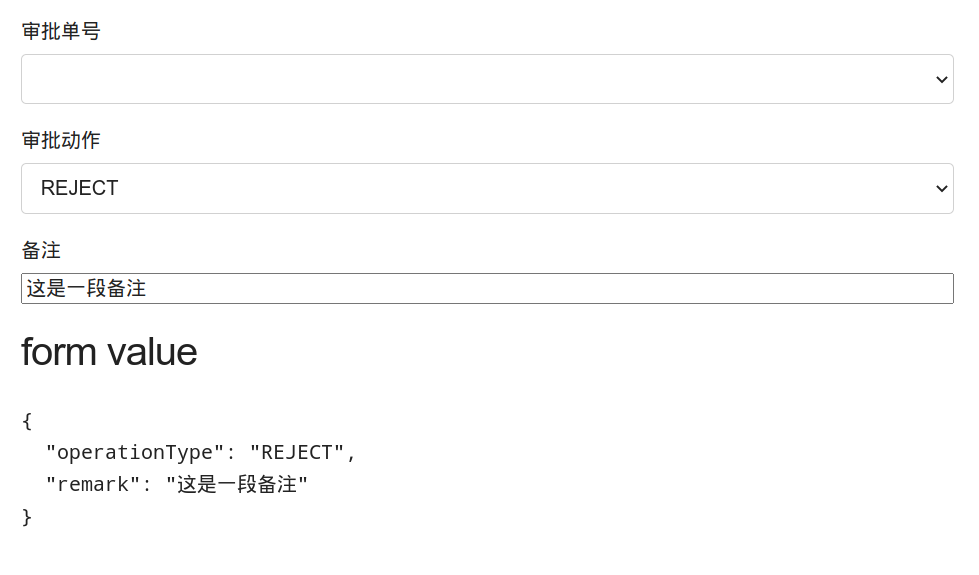

# One solution for form

分享人: ISON

---

# Agenda

- Why
- 定义
- 原理
- 功能 RoadMap 参考
- POC showcase
- Q & A

---

# Why

**TlTR**

程序员有三大美德:
- Laziness
- Impatience
- hubris

** FROM: http://wiki.c2.com/?LazinessImpatienceHubris

---

# Why

**Paint Point**

- Lots of Form Page make me Annoying
- Our Form almost a mapping of api request body.

---

# 定义

这是一个表单生成工具
它能将 API 定义自动生成默认的表单 UI
它能减少或避免 API 定义中的数据映射表单的重复劳作
它允许开发者使用自定义的表单组件而非默认的组件映射实现

--- 

# 原理 - 生成逻辑

--- 

# 原理 - 表单逻辑

---

# 原理 - Parser

---

# 功能 RoadMap 参考

- [X] 实现 MVP 将 Swagger.json 半自动化的映射到默认表单上 <- Now Here
- [ ] 实现或使用某个表单库，实现表单元素间的联动逻辑
- [ ] 在表单之外提供默认的 API 调用方法，进一步减少重复劳作
- [ ] 完善相关逻辑，消除中间的手工环节，提高自动化成都

---

# POC showcase

--- 
<!-- _class: lead -->
# Q & A

---
<!-- _class: lead -->
# Thank You

Code Base: <https://github.com/azzgo/form-generator-from-swagger>